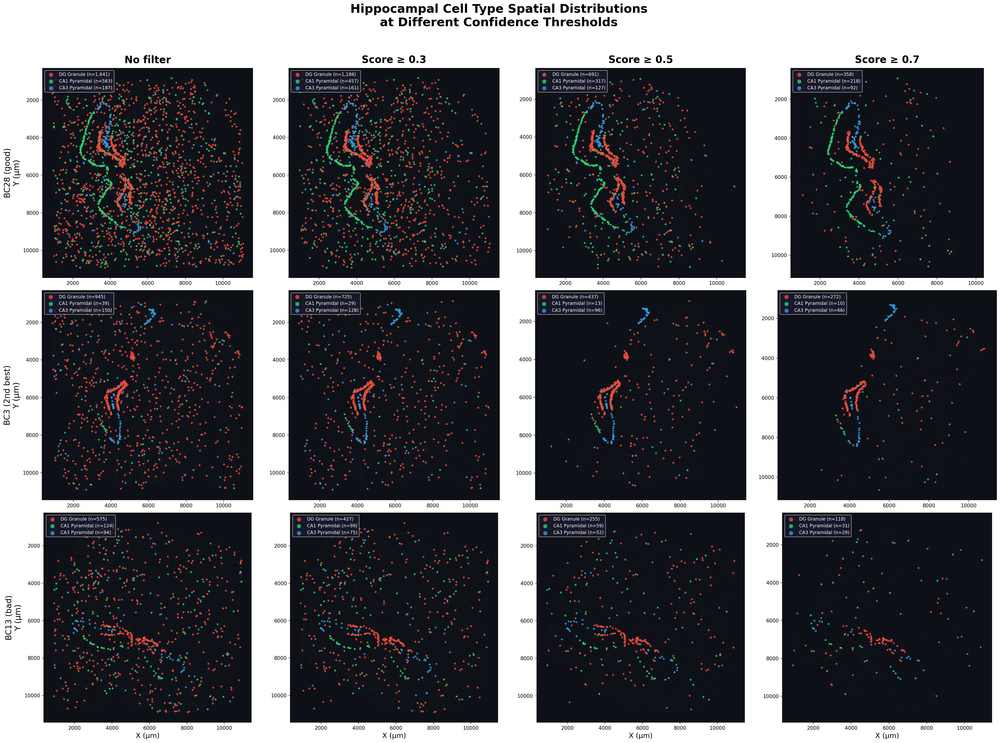
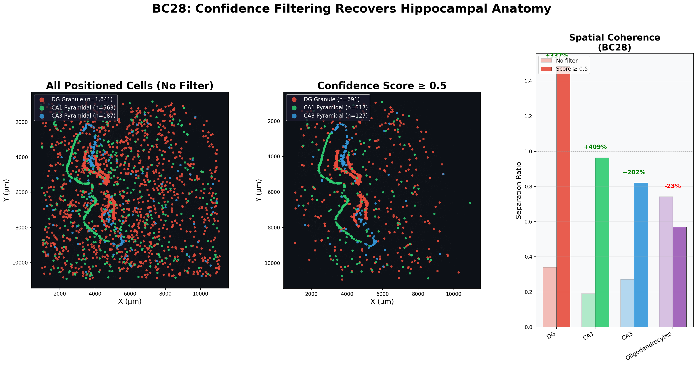
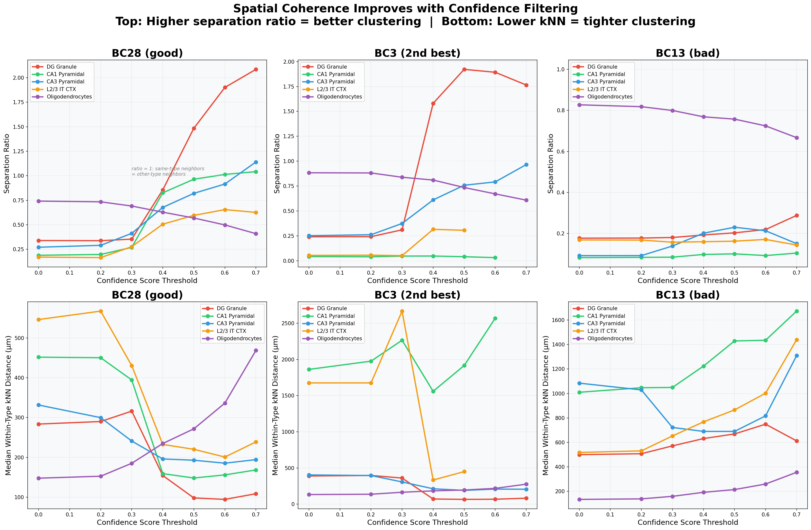
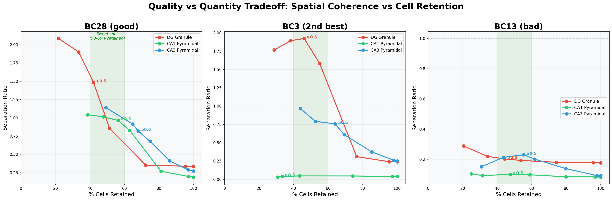
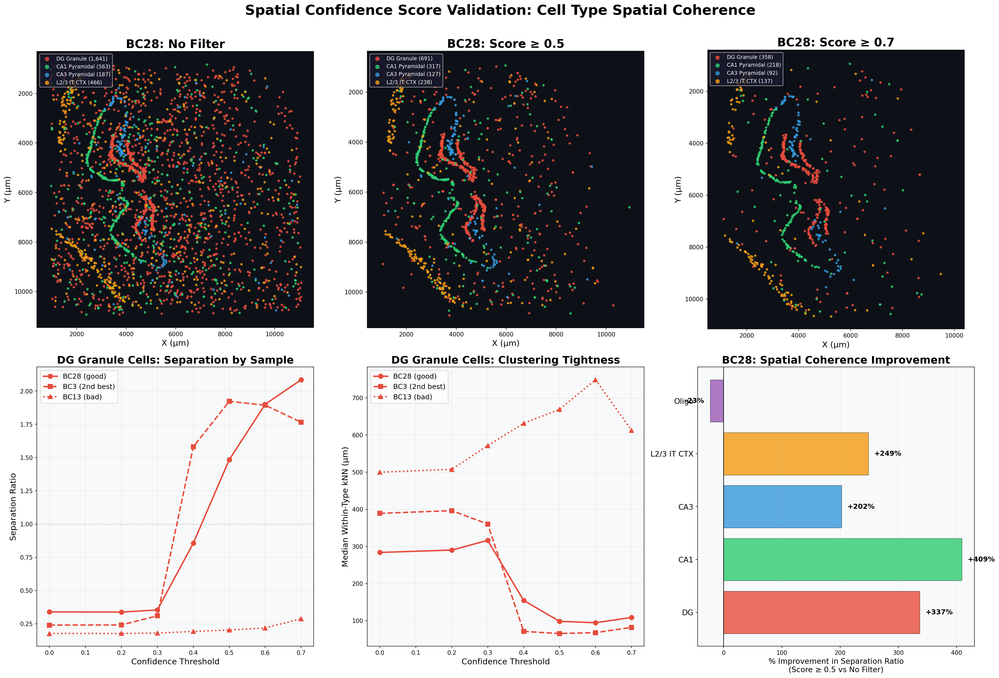
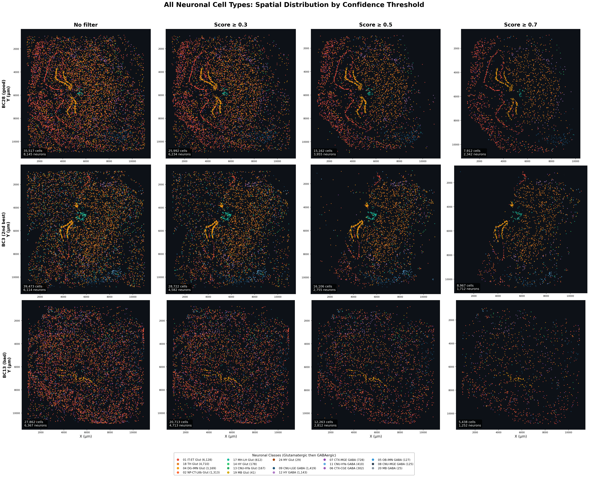
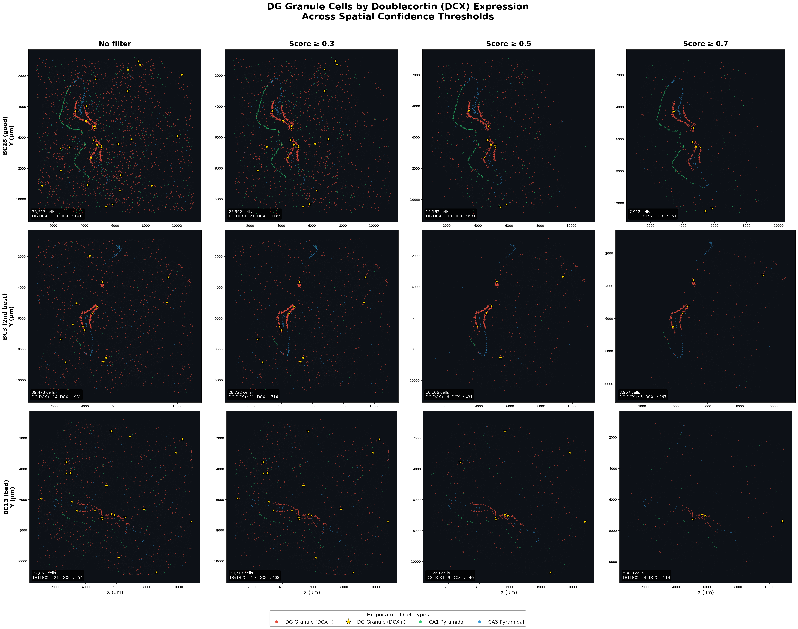
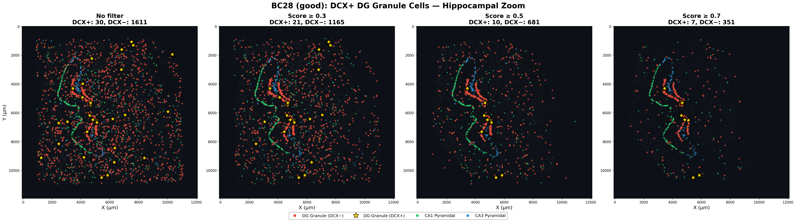

# Spatial Confidence Scoring for Slide-Tags (Curio Trekker) Data

## Quick Start

```bash
# Step 1: Score a sample (~3 min per sample)
python run_scoring.py BC28 ../data

# Step 2: Merge cell type annotations (requires annotated h5ad)
python run_annotations.py ../data/annotations.h5ad

# Step 3: Compute validation metrics + generate figures
python run_validation.py

# Step 4: Generate specialized visualization figures
python run_visualization.py --type all
```

All configuration is in `spatial_confidence/config.py`. Key parameters can be overridden via command-line arguments.

---

## Summary

We developed a **continuous spatial positioning confidence score** for cells processed through the Curio Trekker Slide-Tags pipeline. This score enables users to filter for the most precisely positioned cells in downstream spatial analyses, rather than relying solely on Trekker's binary positioned/unpositioned classification. Validation against known neuroanatomical cell types demonstrates that confidence filtering produces dramatically more anatomically coherent spatial maps — with **3-8x improvement in spatial clustering metrics** for hippocampal cell types in our best samples.

---

## Background and Motivation

The Trekker pipeline assigns spatial positions to single nuclei by:
1. Matching each nucleus's spatial barcodes to known bead coordinates on the tile
2. Running DBSCAN clustering (eps=50um, minPts=4) on the physical locations of each cell's matched barcodes
3. Classifying cells as **confidently positioned** (1 cluster), **ambiguously positioned** (2+ clusters), or **unpositioned** (0 clusters)

However, in all three samples we tested (BC28, BC3, BC13), the overwhelming majority of each cell's spatial barcodes are ambient contamination — **>99% of spatial barcode UMI is classified as DBSCAN noise** even in confidently positioned cells (median signal fraction ~0.3-0.5%). This means Trekker's binary classification treats all positioned cells equally, despite substantial variation in positioning quality.

### Initial investigation: ambient spatial barcode decontamination

We first investigated whether ambient spatial barcode decontamination (analogous to CellBender for RNA) could rescue unpositioned cells. We estimated the ambient spatial barcode profile from unpositioned cells and tested both subtraction-based and enrichment-based approaches. **Result: decontamination did not meaningfully rescue additional cells** — the ambient profile is nearly identical across positioned and unpositioned cells (r > 0.99), and the difference between positioned and unpositioned cells is not contamination level but rather whether a small number of local barcodes form a spatial cluster above the noise floor.

This finding motivated the development of a **quality scoring approach** rather than a decontamination approach.

---

## The Spatial Confidence Score

### What it measures

The confidence score quantifies **how reliable a cell's spatial position estimate is**, based on the quality of the DBSCAN cluster that determines its location. It ranges from 0 (no spatial information) to 1 (highest confidence positioning).

### Components

The score is a **weighted average of five rank-normalized components**:

| Component | Weight | What it captures | Better when... |
|-----------|--------|-----------------|----------------|
| **Signal fraction** | 2.0 | Proportion of total spatial barcode UMI in the top DBSCAN cluster | Higher (more signal relative to noise) |
| **Signal bead count** | 1.5 | Number of distinct beads in the top cluster | Higher (better spatial triangulation) |
| **Cluster compactness** | 1.5 | Inverse of the weighted RMS radius of the top cluster, normalized as `1/(1 + radius/50um)` | Higher (tighter cluster = more precise position) |
| **Signal gap ratio** | 1.0 | log(1 + ratio of top cluster UMI to 2nd cluster UMI); single-cluster cells score highest | Higher (less ambiguity between candidate positions) |
| **Max UMI enrichment** | 1.0 | Ratio of the maximum single-barcode UMI to the per-barcode mean | Higher (stronger peak signal) |

Each component is **rank-normalized within the positioned cells of each sample**, making the score robust to outliers and comparable across samples with different overall signal levels.

### Handling of different cell categories

- **Confidently positioned cells** (Trekker 1 cluster, minPts=4): Scored directly from components. Median score ~0.6.
- **Ambiguously positioned cells** (Trekker 2+ clusters, minPts=4): Scored based on the **best cluster**. These actually score higher than "confident" cells (median ~0.67) because they tend to have more signal beads. The `signal_gap_ratio` component penalizes cases where the top two clusters are similar in size.
- **Rescued cells** (originally unpositioned, found clusters at minPts=2-3): Scored identically, but receive a **minPts penalty** (0.8x for minPts=2, 0.9x for minPts=3) to reflect the inherently lower reliability of clusters found with relaxed parameters. Median penalized score ~0.29.

### Score distributions by sample

| Sample | Confident (median) | Ambiguous (median) | Rescued (median) |
|--------|--------------------|--------------------|------------------|
| BC28 (good) | 0.612 | 0.668 | 0.287 |
| BC3 (2nd best) | 0.640 | 0.696 | 0.294 |
| BC13 (bad) | 0.594 | 0.658 | 0.288 |

### Diagnostic: score distributions and spatial maps


*Score distributions by Trekker status (top left), by minPts used (top center), signal fraction (top right), and spatial maps showing cells scored at minPts=4 only (bottom left), all scored cells (bottom center), and rescued previously-unpositioned cells (bottom right).*

---

## Validation: Cell Type Spatial Coherence

We validated the confidence score using independently-derived cell type annotations (MapMyCells taxonomy labels transferred from the Allen Brain Cell Atlas). The key question: **does filtering for higher confidence scores produce more anatomically coherent spatial patterns for known spatially-restricted cell types?**

### Test cell types

We focused on hippocampal and cortical cell types with well-known spatial distributions:
- **DG Granule cells** (subclass `037 DG Glut`) — should cluster tightly in the dentate gyrus
- **CA1 Pyramidal cells** (subclass `016 CA1-ProS Glut`) — should cluster in CA1
- **CA3 Pyramidal cells** (subclass `017 CA3 Glut`) — should cluster in CA3
- **L2/3 IT CTX** (subclass `007 L2/3 IT CTX Glut`) — should localize to cortical layer 2/3
- **Oligodendrocytes** (subclass `327 Oligo NN`) — distributed throughout tissue (negative control)

### Metrics

We computed two complementary spatial coherence metrics:

1. **Separation ratio**: For each cell of a given type, the ratio of (mean distance to 10 nearest *other-type* neighbors) / (mean distance to 10 nearest *same-type* neighbors). Values > 1 mean the cell type is spatially clustered; higher is better.

2. **Within-type kNN distance**: Median distance to the 10 nearest neighbors of the same type. Lower means tighter spatial clustering.

### Results

#### BC28 (good sample) — Separation ratio improvement at score >= 0.5

| Cell type | Unfiltered | Score >= 0.5 | Improvement |
|-----------|-----------|-------------|-------------|
| DG Granule | 0.34 | 1.48 | **+337%** |
| CA1 Pyramidal | 0.19 | 0.96 | **+409%** |
| CA3 Pyramidal | 0.27 | 0.82 | **+202%** |
| L2/3 IT CTX | 0.17 | 0.60 | **+249%** |
| Oligodendrocytes | 0.74 | 0.57 | -23% (expected) |

#### Within-type kNN distance (um) at score >= 0.5

| Cell type | Sample | Unfiltered | Score >= 0.5 | Change |
|-----------|--------|-----------|-------------|--------|
| DG Granule | BC28 | 284 | 98 | **-65%** |
| DG Granule | BC3 | 389 | 65 | **-83%** |
| DG Granule | BC13 | 500 | 669 | +34% (no improvement) |
| CA1 Pyramidal | BC28 | 452 | 148 | **-67%** |
| CA3 Pyramidal | BC28 | 332 | 193 | **-42%** |
| CA3 Pyramidal | BC3 | 404 | 190 | **-53%** |

#### Key observations

1. **BC28 and BC3 show dramatic improvement**: Hippocampal cell types go from diffusely scattered (separation ratio < 0.4) to tightly spatially clustered (separation ratio > 1) with confidence filtering. DG granule cells' within-type kNN distance drops from ~300-400um to 65-98um — revealing real dentate gyrus anatomy.

2. **BC13 (bad sample) shows minimal improvement**: Even with filtering, separation ratios remain low and kNN distances don't decrease. This confirms that BC13's spatial signal is genuinely poor, not just obscured by noise.

3. **Oligodendrocytes get slightly worse with filtering** — this is the expected result and serves as a negative control. Oligos are distributed throughout the brain, so filtering just makes them sparser without improving coherence.

4. **The optimal threshold balances quality and quantity**: A threshold of **0.4-0.5** retains 40-55% of cells while capturing most of the spatial coherence improvement. Beyond 0.7, diminishing returns set in as cell counts become low.

### Hippocampal cell types across confidence thresholds



*DG Granule (red), CA1 Pyramidal (green), and CA3 Pyramidal (blue) cells at four confidence thresholds across three samples. Note the emergence of anatomically coherent hippocampal structure as the threshold increases in BC28 and BC3, while BC13 shows minimal improvement.*

### Before/after comparison (BC28)



*Left: all positioned cells (no filter). Center: score >= 0.5. Right: quantitative improvement in separation ratio per cell type. Spatially restricted types (DG, CA1, CA3, L2/3) improve dramatically; distributed types (Oligodendrocytes) decrease as expected.*

### Spatial coherence metrics vs threshold



*Top row: separation ratio (higher = better spatial clustering). Bottom row: within-type kNN distance (lower = tighter clustering). Lines show each cell type across confidence thresholds. The improvement saturates around threshold 0.5-0.6.*

### Quality vs quantity tradeoff



*Separation ratio vs percentage of cells retained for hippocampal types across all three samples. The green shaded region marks the "sweet spot" (50-60% retention). Labels indicate the 0.5 threshold point.*

### Summary panel



*Top row: BC28 spatial maps at three thresholds with DG (red), CA1 (green), CA3 (blue), and L2/3 IT CTX (orange). Bottom row: DG separation ratio by sample, DG kNN tightness by sample, and improvement bar chart.*

### All neuronal cell types



*All 17 neuronal classes at four confidence thresholds across three samples. Warm colors = glutamatergic, cool colors = GABAergic. Cell counts annotated per panel. Note how anatomical structure emerges with increasing threshold.*

### DCX+ immature DG granule cells

We split DG Granule cells (subclass `037 DG Glut`) by expression of Doublecortin (DCX), a marker of immature/newborn neurons. Cells with >=1 DCX UMI count are classified as DCX+. These are rare (15-30 per sample, ~1.5-3.6% of DG Granule cells).



*DG DCX+ cells (gold stars) vs DCX- (red dots), with CA1 (green) and CA3 (blue) context, at four confidence thresholds across three samples.*



*Zoomed hippocampal region for BC28 showing DCX+ DG granule cells (gold stars, 3x enlarged) relative to the DG granule cell population and CA1/CA3 layers.*

---

## Practical Recommendations

### How to use the confidence score

The output file for each sample (`confidence_scores_rescued_{SAMPLE_ID}.csv`) contains one row per cell with the following key columns:

| Column | Description |
|--------|-------------|
| `cell_bc` | Cell barcode (matches Trekker and anndata) |
| `confidence_score_penalized` | **The score to use for filtering** (0-1) |
| `x_um`, `y_um` | Spatial coordinates in microns |
| `n_clusters` | Number of DBSCAN clusters (0 = unpositioned) |
| `trekker_status` | Original Trekker classification |
| `minpts_used` | Whether positioned at minPts=4 (standard) or 2-3 (rescued) |
| `signal_fraction` | Raw signal fraction in top cluster |
| `signal_n_beads` | Number of beads in top cluster |
| `cluster_radius_um` | Spatial radius of top cluster |
| `cluster_compactness` | Compactness metric (0-1) |

### Recommended thresholds

| Threshold | Typical retention | Use case |
|-----------|------------------|----------|
| **>= 0.3** | ~73% of cells | Loose filter. Removes the worst-positioned cells (mostly rescued at minPts=2). Good starting point for exploratory analyses. |
| **>= 0.4** | ~52% of cells | Moderate filter. Recommended for most spatial analyses. Good balance of quantity and quality. |
| **>= 0.5** | ~42% of cells | **Recommended for analyses requiring spatial precision.** Captures most of the spatial coherence improvement. Sweet spot for hippocampal cell type analyses. |
| **>= 0.6** | ~33% of cells | Stringent. Use when spatial precision is critical (e.g., layer-specific analyses). |
| **>= 0.7** | ~22% of cells | Very stringent. Best spatial quality but may lose rare cell types. |

### When to use which threshold

- **Cell type proportion analyses** (no spatial component): Use >= 0.3 or no filter — spatial precision doesn't matter, you want maximum cells.
- **Spatial neighborhood analyses**: Use >= 0.5. Poorly positioned cells add noise to neighbor graphs.
- **Layer/region-specific analyses**: Use >= 0.5 to 0.6. Mispositioned cells crossing anatomical boundaries will contaminate region-specific results.
- **Spatial gene expression patterns** (e.g., Moran's I): Use >= 0.4 to 0.5.
- **Visualization / figure generation**: Use >= 0.5 to 0.7 depending on desired clarity.

### Integration with existing anndata objects

```python
import pandas as pd
import anndata as ad

# Load your anndata
adata = ad.read_h5ad('your_sample.h5ad')

# Load confidence scores
scores = pd.read_csv('confidence_scores_rescued_SAMPLE.csv')

# Match barcodes (strip -1 suffix if needed)
scores = scores.set_index('cell_bc')
adata.obs['spatial_confidence'] = adata.obs.index.map(
    lambda x: scores.loc[x.replace('-1',''), 'confidence_score_penalized']
    if x.replace('-1','') in scores.index else 0.0
)

# Filter for analyses requiring spatial precision
adata_spatial = adata[adata.obs['spatial_confidence'] >= 0.5]
```

### Sample quality assessment

The confidence score also serves as a **sample-level quality diagnostic**:

- If filtering to >= 0.5 reveals anatomically coherent cell type distributions (as in BC28 and BC3), the spatial data is usable.
- If filtering shows no improvement in spatial coherence (as in BC13), the sample's spatial signal may be too weak for reliable spatial analyses regardless of filtering.

### What about the ambiguous cells?

A key finding: **ambiguous cells (2+ DBSCAN clusters) should NOT be excluded by default.** They actually have higher median confidence scores than "confident" cells because they tend to have more signal beads. Our scoring approach resolves the ambiguity by evaluating the quality of the *best* cluster. Cells where the top cluster clearly dominates (high `signal_gap_ratio`) receive high scores despite being classified as "ambiguous" by Trekker.

---

## Scaling to All Samples

### Required input files (per sample, from Trekker output)

- `df_whitelist_{SAMPLE_ID}.txt` (in misc/ directory)
- `matching_result_{SAMPLE_ID}.csv` (in misc/ directory)
- `coords_{SAMPLE_ID}.txt` (main output directory)

### Running the pipeline

```bash
# Step 1: Score a new sample
python run_scoring.py SAMPLE_ID /path/to/trekker/output

# Step 2: Merge annotations (if you have a shared h5ad with cell type labels)
python run_annotations.py /path/to/annotations.h5ad --samples SAMPLE_ID

# Step 3: Validation figures (once all samples are scored + annotated)
python run_validation.py --samples SAMPLE1,SAMPLE2,SAMPLE3

# Step 4: Specialized visualizations
python run_visualization.py --type all --samples SAMPLE1,SAMPLE2,SAMPLE3
```

Runtime: ~3 minutes per sample on a laptop (dominated by per-cell DBSCAN at minPts=2).

### Code structure

```
spatial_confidence/        # Python package
    config.py              # All constants (EPS, minPts, weights, etc.)
    io.py                  # Data loading utilities
    scoring.py             # DBSCAN + confidence score computation
    annotations.py         # Merge cell type annotations
    validation.py          # Spatial coherence metrics
    plotting.py            # Reusable plotting helpers
    cell_types.py          # Cell type definitions and colors
run_scoring.py             # Entry point: score a sample
run_annotations.py         # Entry point: merge annotations
run_validation.py          # Entry point: metrics + validation figures
run_visualization.py       # Entry point: specialized figures
archive/                   # Previous exploration scripts (decontamination, etc.)
```

---

## Limitations

1. **The score is relative within each sample** — rank normalization means a score of 0.5 in BC28 and 0.5 in BC13 represent different absolute signal levels. Cross-sample comparisons should use the raw component values.

2. **Rescued cells (minPts=2-3) have inherently lower reliability** — the 0.8x penalty is a heuristic. Users should be cautious about including these cells in precision-sensitive analyses.

3. **The score does not validate the cell's position** — it measures confidence in the DBSCAN clustering quality, not whether the position is biologically correct. A high-confidence cell could still be mispositioned if the signal barcodes happen to cluster at the wrong location.

4. **BC13-like samples may not benefit from this approach** — when the underlying spatial signal is too weak, no amount of filtering recovers anatomical structure.
