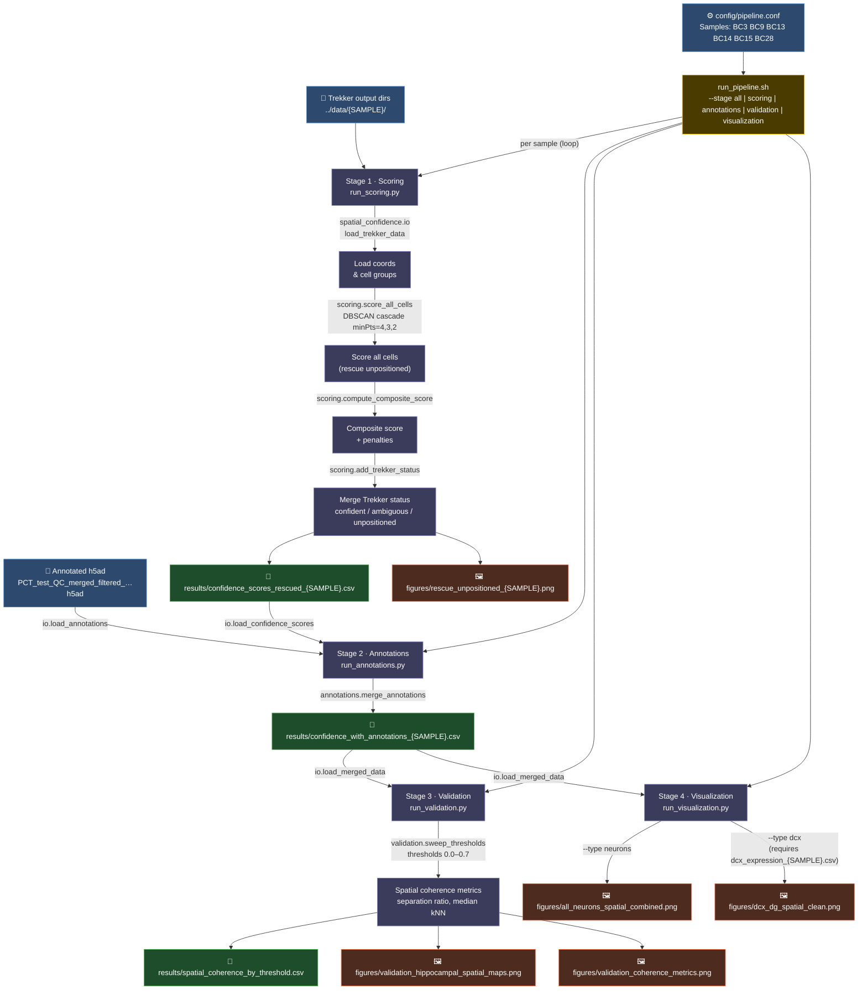

# Trekker Spatial Confidence Pipeline

## Stage summary

| Stage | Script | Input | Output |
|---|---|---|---|
| 1 · Scoring | `run_scoring.py` | Trekker output dir (per sample) | `confidence_scores_rescued_{SAMPLE}.csv`, diagnostic figure |
| 2 · Annotations | `run_annotations.py` | h5ad + stage-1 CSVs | `confidence_with_annotations_{SAMPLE}.csv` |
| 3 · Validation | `run_validation.py` | stage-2 CSVs | `spatial_coherence_by_threshold.csv`, validation figures |
| 4 · Visualization | `run_visualization.py` | stage-2 CSVs (+ optional DCX CSV) | spatial map figures |

### Key scoring details (Stage 1)
- DBSCAN minPts cascade `4 → 3 → 2` rescues unpositioned cells
- Composite score penalized for low signal fraction and ambiguous Trekker status
- Output columns defined in `spatial_confidence/config.py → OUTPUT_COLUMNS`